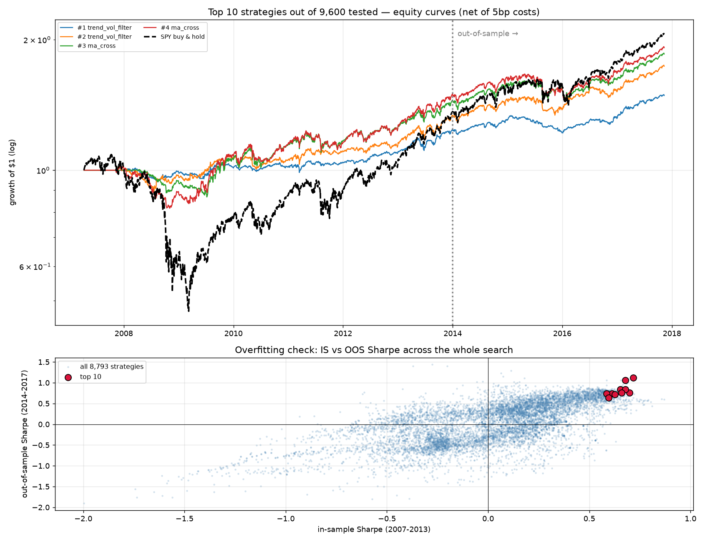

# 9,600-Strategy Backtest Search

Generates and backtests **9,600 rule-based trading strategies** over a 40-asset
liquid US universe (2007–2017, daily), then selects the **top 10** using a
strict in-sample / out-of-sample protocol with multiple-testing correction.

**→ See [REPORT.md](REPORT.md) for the results and the top 10 table.**


## MT4 indicator
The #1 strategy is ported to MQL4 in [`mt4/TrendVolFilter.mq4`](mt4/) — signal-parity
verified against the Python backtest (100% agreement). See [mt4/README.md](mt4/README.md).

## Layout
| file | purpose |
|---|---|
| `src/data.py` | builds the OHLCV price panel from the raw dataset |
| `src/indicators.py` | cached vectorised indicators (MA, RSI, ATR, vol, z-score…) |
| `src/strategies.py` | 10 rule families × parameter grids × 3 sizing overlays = 9,600 |
| `src/backtest.py` | portfolio backtester: 1-day lag, 5bp costs, gross-exposure cap |
| `src/run_search.py` | runs the whole search (~2 min) |
| `src/select_top.py` | screens, composite score, de-duplication, deflated Sharpe |
| `src/report.py` | chart + REPORT.md |

## Run
```bash
pip install numpy pandas pyarrow matplotlib
RAW_DIR=/path/to/ohlcv python3 src/data.py
python3 src/run_search.py && python3 src/select_top.py && python3 src/report.py
```
Raw data: the public "Huge Stock Market Dataset" (daily OHLCV `.us.txt` files
under `Stocks/` and `ETFs/`), pointed at by `RAW_DIR`.

## Strategy families
`ma_cross`, `price_vs_ma`, `ts_momentum`, `donchian`, `rsi_reversion`,
`zscore_reversion`, `macd`, `xs_momentum`, `trend_vol_filter`, `breakout_atr` —
each in long-only and long/short mode, each with raw / 10% / 20% vol-target sizing.
