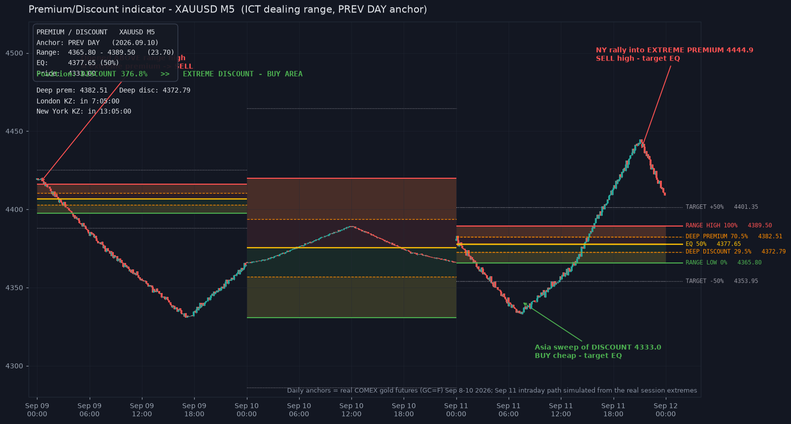

# Premium / Discount Indicator (MT4 + MT5)

ICT-style **Premium & Discount** dealing-range indicator for MetaTrader 4 and MetaTrader 5.
It draws the daily (or Asia-session) dealing range and tells you, in real time, whether price is

* **EXPENSIVE — Premium** (above the range equilibrium) → where you want to **sell high**
* **CHEAP — Discount** (below the range equilibrium) → where you want to **buy low**

> **The idea in one line:** buy in the discount half of the range, sell in the premium half,
> with the equilibrium (EQ) as the profit target / decision line — and the 70.5% / 29.5%
> "deep" levels (ICT OTE) as the optimal entry areas.

*Demo: XAUUSD M5. Daily anchors are real COMEX gold-futures candles (Sep 8–10, 2026); the
Sep 11 intraday path is simulated from the real session extremes. Second chart — real hourly
PAX Gold data: [examples/premium_discount_paxg_h1_real.png](examples/premium_discount_paxg_h1_real.png).*

---

## Levels drawn

All levels are fractions of the dealing range (`range = high − low`):

| Level | Fraction | Meaning |
|---|---|---|
| Target +50% | high + 0.5×range | extension target |
| **Range High** | 100% | premium edge — sell area |
| **Deep Premium 70.5%** | 70.5% | optimal sell entry (OTE) |
| Half Premium 75% (optional) | 75% | mid level |
| **EQ (equilibrium) 50%** | 50% | premium/discount divider, profit target |
| Half Discount 25% (optional) | 25% | mid level |
| **Deep Discount 29.5%** | 29.5% | optimal buy entry (OTE) |
| **Range Low** | 0% | discount edge — buy area |
| Target −50% | low − 0.5×range | extension target |

Zone fills (premium = red, discount = green, deep sub-zones = orange) are drawn **behind**
the candles; on MT5 they use real transparency (alpha), on MT4 pale solid colors.

## Anchor modes

| Mode | Range source | Behavior |
|---|---|---|
| `Previous day` (default) | yesterday's completed daily candle | stable all day, resets at the broker's new daily candle |
| `Current day` | today's developing daily candle | live range; falls back to previous day when too small |
| `Asia session` | most recent **completed** Asia session (default 00:00–06:00 server time) | locks after Asia ends; weekend/holiday safe |

`EQ = session open` can be selected instead of the 50% midpoint.

## Info panel

Shows symbol/timeframe, anchor, range high/low and size, EQ, current price, the current
**position** (`DISCOUNT 42% — BUY AREA` / `PREMIUM 68% — SELL AREA` / `DEEP …` / `EXTREME …`),
deep levels and the London / New York kill-zone status with a countdown.

## Alerts (bar-close only — never repaint)

Alerts are evaluated **once, at the open of a new bar, using the closed bar only**, so a
fired alert is never rewritten later. Each event fires at most once per session:

* price **entered DISCOUNT** (crossed EQ down) — BUY AREA
* price **entered PREMIUM** (crossed EQ up) — SELL AREA
* **DEEP DISCOUNT / DEEP PREMIUM** reached (29.5% / 70.5% crossing)
* **EQ retest** after a deep excursion — take-profit / reversal area
* session **opened deep** in discount or premium

Optional kill-zone filter (default: London 07:00–10:00, New York 13:00–16:00 server time)
silences alerts outside those windows. Popup / sound / mobile push / email, each toggleable.

## Installation

**MT4** — copy `PremiumDiscount.mq4` to `MQL4/Indicators/`, restart MetaTrader 4 (or refresh
the Navigator), drag it onto any chart (M1–D1; M5–H1 recommended).

**MT5** — copy `PremiumDiscount.mq5` to `MQL5/Indicators/`, restart MetaTrader 5, drag onto a chart.

No DLLs, no buffers, no external files — pure chart-object drawing, works in the Strategy
Tester too.

## Inputs (summary)

**Anchor / range:** `AnchorMode`, `UseOpenAsEQ`, Asia hours, `MaxBarsLookback`, `MinRangePoints`
(0 = auto ≈10 pips / $1 gold). A too-small range (weekend, holidays, flat bars) automatically
falls back to an older valid range.

**Display:** zone fills + opacity, deep fills, levels/labels, half levels, extensions,
current-price line, panel + corner, all colors, line widths.

**Alerts:** enable, kill-zone-only, popup/sound/push/email, event switches, sound file.

**Kill zones:** two configurable windows (cross-midnight windows are supported).

## How to trade with it

1. **Wait for a sweep into a deep level**: price pushes to the 70.5% deep premium (look to
   **sell**) or the 29.5% deep discount (look to **buy**) — ideally inside a kill zone.
2. **Confirm** on your own entry model (a close back through the deep level, a displacement
   candle, an order block…).
3. **Target EQ first**, then the opposite side of the range; extensions ±50% are runner targets.
4. If price is near EQ and far from the edges — there is no edge: stand aside.

The indicator is a *map*, not a signal generator. It never tells you a trade is "guaranteed" —
nothing in trading is. Past performance doesn't guarantee future results.

## How it was validated

There is no MetaEditor in the sandbox this was built in, so the exact indicator logic was
ported 1:1 to Python (`validation/engine.py`) and tested (`validation/run_validation.py`):

* **78/78 tests pass** — unit tests (level/zone math, cross-midnight windows, weekend/holiday
  fallbacks), **no-repaint determinism tests** (incremental vs full run produce identical alert
  histories for all three anchor modes), alert-once semantics, kill-zone gating.
* **Real-data smoke tests** on real COMEX gold-futures daily candles, real EURUSD daily rates
  (ECB via Frankfurter) and real hourly PAX Gold data (CoinGecko).
* `validation/mql_check.py` statically checks both MQL sources (balanced brackets/strings,
  MQL4/MT5-appropriate API usage, defined-function checks, `StringFormat` arg counts).

Both `.mq4` and `.mq5` mirror the validated engine function-for-function.

## Notes

* All session math uses **server/broker time** (`TimeCurrent()`). Check your broker's server
  timezone when setting Asia and kill-zone hours.
* The day boundary for `Previous day`/`Current day` follows the broker's **D1 candle** start,
  so it always matches the daily candles you see on the chart.
* Objects are named `PD_<chartId>_…` and are cleaned up on remove / timeframe change.
* License: MIT — use freely, at your own risk. Trading involves substantial risk of loss.
