# Which fast/slow EMA pair is actually best?

A daily-bar, multi-market study: **9,761,738 backtests** — 1,525,036 on the base grid (9,299 pairs
× 82 markets × 2 position styles), the same grid re-run at zero cost, triple cost and with simple
moving averages, a weekly-bar version, and a 2,192,352-row extended grid to 1,200-bar slow EMAs.
Markets span **1970-06-15 → 2026-03-28**, and every answer is checked out-of-sample two different
ways.

---

## 1. The short answer

| | answer |
|---|---|
| **Headline pair** | **fast 60 / slow 132** — round it to **EMA(60) over EMA(130)**: a quarter vs a half trading year |
| **The range you should actually use** | **fast 40–80, slow 115–165 bars** (≈2–4 months and 6–8 months). The optimum is a *plateau*, not a peak, and the plateau is the finding. |
| **Ratio** | slow ≈ 2.2–2.9 × fast at the optimum; per-market in-sample winners have a median ratio of 3.4 (IQR 2.0–8.0) |
| **Long/flat or long/short?** | **long/flat.** Long/short's entire surface is flatter and lower: median cross-market Sharpe 0.211 (IQR 0.194–0.225, max 0.281) vs 0.386 (IQR 0.370–0.400, max 0.455) for long/flat |
| **What it costs to run** | 60/132 turns over **1.46 round trips/year** per market (one every ~8 months; long on 66% of bars). Costs eat **0.10 pp of CAGR a year** at that speed. A 10/20 pair trades 11×/yr and loses 0.43 pp; a 2/6 pair trades 36×/yr and its gross 2.9%/yr becomes **0.03%/yr net** — the fastest corner of the grid is entirely commissions |
| **The textbook pairs are bad** | 50/200 "golden cross" ranks **2,219th of 9,299** long-only and **6,992nd** long/short. 12/26 (MACD) ranks **9,177th** and **9,011th**. 10/20 long/short has a median Sharpe of **0.001** and a *negative* neighbour floor (−0.139) |
| **Does it beat buy & hold?** | On per-market Sharpe: **no** (median buy & hold Sharpe in the untouched out-of-sample window 0.408 vs 0.294 for the best-selected pair). On **risk**: **yes, decisively** — at a matched 10% vol target on a diversified 82-market book, the worst drawdown falls from **−63% to −21%**, Calmar rises 0.11 → 0.43, and Sharpe 0.74 → 0.97 |

**If you only do one thing:** long/flat on daily closes, EMA(60) vs EMA(130), applied to a
diversified basket — and treat everything from 40/115 to 80/165 as the same answer. Re-tuning it per
market, per asset, or per year makes it *worse* (§5).

---

## 2. How this was tested

* **Universe — 82 markets**, deliberately mixed so a pair has to work everywhere to win: 26 US
  large caps (StarTrader, 2008+), 6 US indices, 4 US ETFs, 3 crypto (BTC/ETH), 16 FX futures,
  10 equity-index futures, 10 commodity futures, 7 rate futures. Median 2,562 daily bars.
* **Data hygiene came first.** A screen dropped 9 series for stale-timestamp artefacts (33–62% zero
  returns, lag-1 autocorrelation +0.18…+0.39 — pysystemtrade's fixed-clock FX *spot* marks). They
  are excluded from the study and used only as a negative control (§8). Back-adjusted futures that
  cross zero (CRUDE_W at −17.37 in 1990) are put on a level-normalised return basis so percentage
  returns cannot explode.
* **Strategy.** Long/flat: long while EMA_fast > EMA_slow at the close, else cash. Long/short: ±1
  (2 units of turnover per flip). The signal uses bar *t*'s close and the position earns bar *t+1*'s
  return — a next-open variant is scored separately (§9).
* **No lookahead by construction, and tested for it.** `r[t] = w[t]·ret[t] − trans[t]·fee` with
  `w[t]` from the previous close. 29 tests cover the EMA definition, one-bar positioning, cost
  accounting, warm-up, drawdown definition, batched-vs-reference-loop equality, and an explicit
  "future prices cannot change a past score" check.
* **Costs** per asset class (stocks 10, index/ETF 6, futures 3–4, crypto 20 bps per position change),
  plus 0× and 3× variants.
* **Warm-up**: the first `slow` bars are dropped per market, so a 700-bar slow EMA is not credited
  with performance it could not have had; ≥250 bars required after warm-up.
* **Grid**: `pair_grid(120, 400, 2, 6, 1.5)` → fasts 2–120, slows 6–400, `slow ≥ 1.5×fast` =
  9,299 pairs, plus a 13,368-pair extension to slow = 1,200.
* **Annualisation is measured from the data, and it mattered.** The first version of the loader
  classified a series as a 365-day market if its *median* bar gap was ≤1.3 days — but business-day
  data alternates 1- and 3-day gaps, so its median gap is 1.0 and **every** series (daily and weekly
  alike) was annualised at 365. That inflated every equity Sharpe by 20% and every weekly Sharpe by
  2.2×, and it made "weekly bars" look superior to daily for no real reason. `_annualisation` now
  counts bars per calendar year (median of the full years: 252 for stocks, 52 for weekly,
  357–365 for crypto, 240–328 for futures with weekend sessions), and `scripts/fix_annualisation.py`
  repaired the cached grids with the exact inverse transform — verified to 5e-16 relative error
  against a fresh backtest of all 9,299 rows for 12 file/market combinations, so the 9.7M results
  were corrected rather than re-run. Every number in this report is post-repair.

---

## 3. The surface is a plateau — that *is* the result

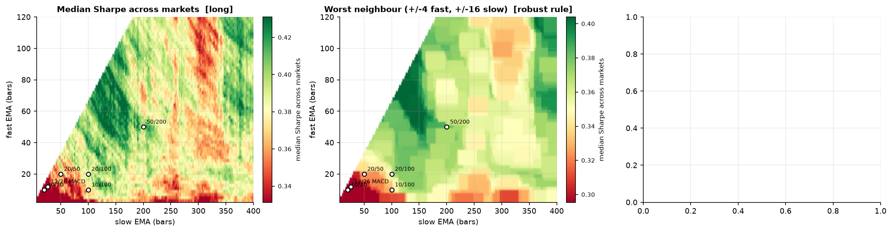
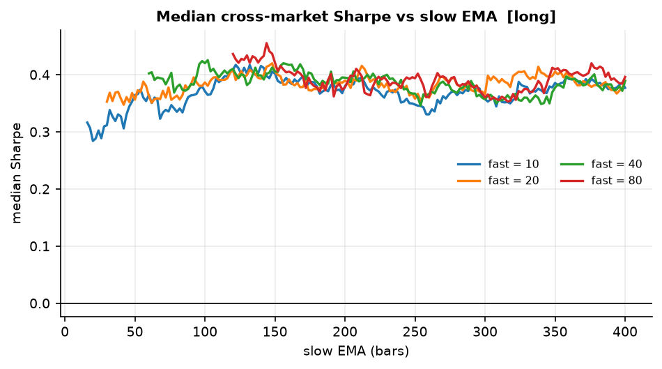

The second figure is the one to read: each line is one fast EMA, x-axis is the slow EMA. Median
cross-market Sharpe wanders between 0.36 and 0.46 across **the entire 60–400-bar range**. The mean
step is 0.0082 per bar along fast and 0.0070 along slow (biggest single step 0.120, whole-surface
range 0.361). Any "peak" you find is one cell wide. That is why the answer was not chosen by
ranking raw medians.

Below it, the same picture scored by the *worst cell in each neighbourhood* — the criterion actually
used. Every fast line from 8 to 60 ends up between 0.32 and 0.41 somewhere across slow 100–400, and
the highest floor on the chart is fast 60 around slow 130–150: the pick, arriving from a completely
different objective than "highest median".

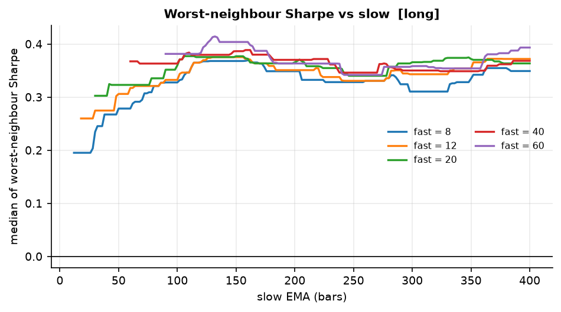

Banded — rows = fast EMA, columns = slow EMA, cell = median cross-market Sharpe, long/flat
(`results/tables/band_med_sharpe_long.csv`; empty cells are excluded by the slow ≥ 1.5×fast rule;
columns past 400 come from the extended grid):

| fast \ slow | 6–15 | 16–30 | 31–60 | 61–120 | 121–200 | 201–300 | 301–400 | 401–700 | 701–1000 |
|---|---|---|---|---|---|---|---|---|---|
| 2–4 | 0.168 | 0.251 | 0.298 | 0.328 | 0.365 | 0.343 | 0.355 | 0.354 | 0.407 |
| 5–9 | 0.251 | 0.289 | 0.305 | 0.360 | 0.382 | 0.367 | 0.365 | 0.380 | 0.414 |
| 10–19 | 0.327 | 0.315 | 0.353 | 0.372 | 0.389 | 0.370 | 0.382 | 0.397 | 0.404 |
| 20–39 | | 0.365 | 0.372 | 0.391 | 0.397 | 0.382 | 0.376 | 0.398 | 0.413 |
| 40–69 | | | 0.395 | 0.402 | **0.415** | 0.382 | 0.385 | 0.399 | 0.419 |
| **70–120** | | | | **0.422** | 0.408 | 0.383 | 0.385 | 0.400 | 0.418 |

Share of the 82 markets that are **positive** (breadth — the robustness criterion, since the mean is
nearly flat):

| fast \ slow | 6–15 | 16–30 | 31–60 | 61–120 | 121–200 | 201–300 | 301–400 | 401–700 |
|---|---|---|---|---|---|---|---|---|
| 2–4 | 0.711 | 0.811 | 0.882 | 0.881 | 0.922 | 0.927 | 0.883 | 0.844 |
| 5–9 | 0.823 | 0.905 | 0.897 | 0.905 | 0.916 | 0.914 | 0.889 | 0.851 |
| 10–19 | 0.915 | 0.892 | 0.870 | 0.912 | **0.938** | 0.925 | 0.915 | 0.861 |
| 20–39 | | 0.866 | 0.913 | 0.933 | **0.941** | 0.923 | 0.910 | 0.848 |
| 40–69 | | | 0.931 | **0.949** | 0.930 | 0.922 | 0.895 | 0.826 |
| 70–120 | | | | 0.925 | 0.912 | 0.899 | 0.869 | 0.813 |

Median Calmar inside the base grid peaks at 0.149 (70–120 × 61–120) with 0.144 next to it (40–69 ×
121–200) — the same hill again. Round trips/year in the sweet spot are 1.1–2.1, versus **35.9/yr for
2–4 × 6–15** at median Sharpe 0.168: the fast corner is where accounts go to die.

### How the winner was picked

The rule was fixed **before** looking at the rankings: maximise the *worst* median Sharpe in a
neighbourhood of ±4 fast / ±16 slow bars, restricted to interior cells, 0.75–14 round trips/year,
and pairs positive in ≥75% of markets. A lucky cell fails this; a broad hill passes it.

**Result: 60/132** — neighbourhood floor 0.414, median 0.431, positive in **93.9% of 82 markets**,
median Calmar 0.150, median max drawdown −32.9%, 1.46 round trips/yr, beats buy & hold in 40.2% of
markets. The next nine on the robust list are 62/130, 62/128, 58/134, 60/130, 78/118, 60/134,
64/130, 64/128, 58/132 — floors 0.412–0.414, breadth 91.5–95.1%. **One hill, not a point.**

For contrast, the naive `argmax` of median Sharpe is **80/144** (0.455). It gives up 5.5% of Sharpe
*relative* to nothing — it is actually higher — but its floor is 0.403 and its "spikiness" (peak
above neighbourhood) is 0.0302 versus 0.0032 for 60/132: **9× more of its number comes from being in
the right cell at the right time.** Given a choice between a 0.024 Sharpe edge and 9× less
curve-fitting, take 60/132. The two rankings swap each other's positions (60/132 is 209th by raw
Sharpe, 80/144 is 239th by the robust rule), which is itself evidence the surface is flat.

### "Given the settings you already use"

| your fast | best slow (robust) | floor | median | breadth | | your slow | best fast | floor | median |
|---|---|---|---|---|---|---|---|---|---|
| 8 | 160 | 0.369 | 0.389 | 91.5% | | 20 | 12 | 0.260 | 0.305 |
| 10 | 134 | 0.379 | 0.405 | 92.7% | | 50 | 32 | 0.353 | 0.382 |
| 12 | 132 | 0.375 | 0.424 | 91.5% | | 100 | 62 | 0.385 | 0.409 |
| 20 | 114 | 0.377 | 0.391 | 92.7% | | 120 | 76 | 0.410 | 0.435 |
| 30 | 132 | 0.381 | 0.413 | 95.1% | | 150 | 54 | 0.409 | 0.430 |
| 40 | 162 | 0.389 | 0.418 | 93.9% | | 200 | 102 | 0.383 | 0.398 |
| 50 | 152 | 0.407 | 0.411 | 93.9% | | 380 | 108 | 0.397 | 0.420 |
| **60** | **132** | **0.414** | **0.431** | **93.9%** | | 400 | 108 | 0.397 | 0.420 |
| 80 | 120 | 0.409 | 0.437 | 92.7% | | | | | |
| 100 | 390 | 0.392 | 0.425 | 85.4% | | | | | |

The meta-message: whatever fast you like, **the answer is a slow around 120–160**, and the worst slow
EMA on each row (0.26–0.35) is only ~0.07 below the best. Long/short behaves the same but with the
best slow pinned to the grid edge (380–400) for *every* fast, i.e. it has no interior optimum.

---

## 4. Famous settings vs found settings

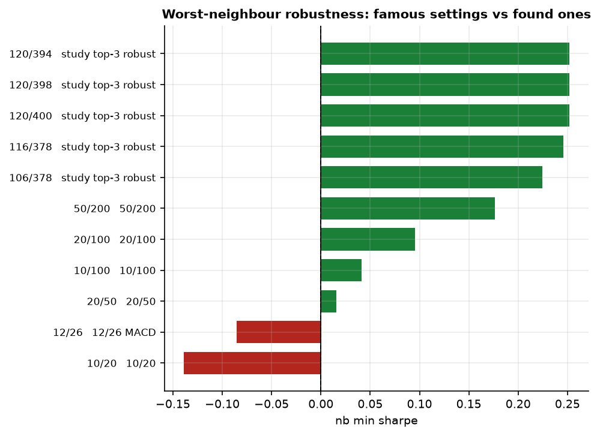

Ranks out of 9,299 pairs; "floor" = neighbourhood-robust Sharpe.

| pair | long/flat median | floor | rank (raw / robust) | long/short median | floor | rank |
|---|---|---|---|---|---|---|
| **60/132** study pick | **0.431** | **0.414** | 209 / **2** | 0.228 | 0.193 | 1,883 / — |
| 80/144 raw best | 0.455 | 0.403 | 1 / 239 | — | — | — |
| 60/116 | 0.447 | 0.382 | 2 / 1,256 | — | — | — |
| 50/200 golden cross | 0.401 | 0.383 | 2,219 / 1,056 | 0.194 | 0.177 | 6,992 / 6,189 |
| 20/100 | 0.387 | 0.360 | 4,490 / 4,709 | 0.128 | 0.095 | 8,611 / 8,484 |
| 10/100 | 0.371 | 0.328 | 6,870 / 8,692 | 0.101 | 0.041 | 8,805 / 8,838 |
| 20/50 | 0.356 | 0.323 | 8,410 / 8,768 | 0.065 | 0.015 | 8,977 / 8,993 |
| 12/26 MACD | 0.319 | 0.260 | 9,177 / 9,215 | 0.057 | **−0.086** | 9,011 / 9,210 |
| 10/20 | 0.284 | 0.226 | 9,262 / 9,250 | 0.001 | **−0.139** | 9,219 / 9,240 |

(The LS robust rank of 60/132 is not tabulated — only the top 40 robust pairs are written out — but its
LS floor of 0.193 is below the LS robust winner's 0.252, which is the point.)

Long/short sharpens it: the entire LS surface runs −0.278 to 0.281 with a median of 0.211, so every
popular short-term pair sits in the bottom 3–4% of a distribution that barely contains anything.
Short-term crossovers on daily bars are whipsaw plus commission; the pairs that survive are slow.

Per-market heat map — where the candidates actually work:

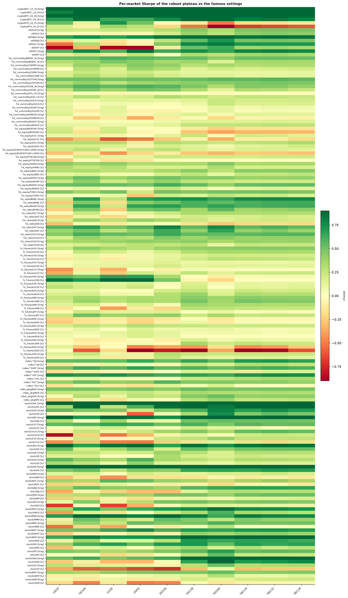

---

## 5. Out-of-sample: two tests, opposite verdicts

### (a) Per-market walk-forward — tuning each market on its own is *worse than not trying*

Six expanding training folds, 78 markets, 390 folds, both modes. Pick the pair that maximises Sharpe
on the training window, then trade the untouched next window:

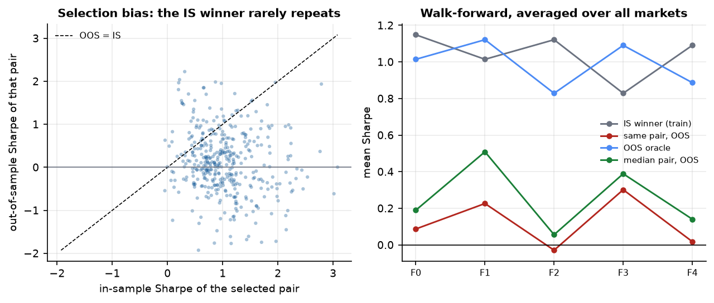

| rule | median OOS Sharpe | positive share | vs median pair |
|---|---|---|---|
| in-sample optimum, re-tuned each fold (long/flat) | 0.243 (in-sample 1.004) | 60.0% | **−0.072** |
| in-sample optimum, re-tuned each fold (long/short) | 0.121 (in-sample 1.041) | 55.4% | **−0.136** |
| oracle: best pair chosen with hindsight | 0.965 | 96.2% | +0.667 |
| **median pair on the grid, no selection at all** | **0.298** | 63.1% | 0 |
| fixed 58/132 (the study's neighbourhood) | 0.294 | 62.8% | −0.010 |

Aggregated per market first, the table above says long/flat 1.004 → 0.243 (−76%) and long/short 1.041
→ 0.121 (−88%). Aggregated per fold it is 0.915 → 0.165 long/flat and 0.962 → 0.087 long/short — a
**negative** correlation between the in-sample and out-of-sample scores across the 390 folds (−0.03
long/flat, −0.155 long/short), and re-optimising loses to doing nothing. Note the pairs listed in that block are only those on the
walk-forward's own coarse lattice, which is why the famous pairs are judged in test (b) instead.

### (b) Cross-market split-sample — the consensus rule *does* transfer

The honest test of what this study actually does: split every market's history at 60%, rank 40
candidate pairs (exactly, no lattice) using **only** the older 60% with the same robust rule, then
read off the untouched 40%:

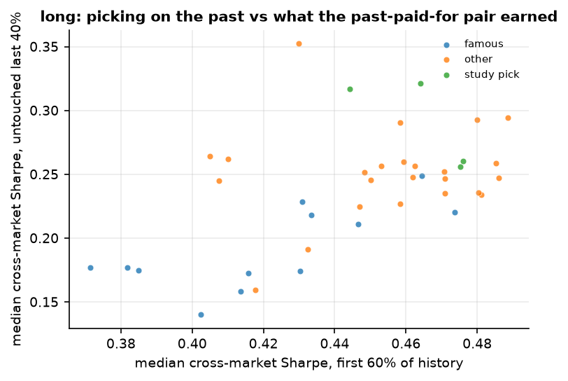

Median cross-market Sharpe of each of the 40 candidates, over 81 markets
(`results/tables/split_sample_summary_long.csv`; the IS rank is on the robust *floor*, which is why
60/132 and 60/120 tie at 1):

| long/flat | IS (older 60%) | OOS (newer 40%) | OOS rank | OOS positive | buy & hold, same OOS window |
|---|---|---|---|---|---|
| **60/120** — chosen by both IS rules (IS floor 0.537) | 0.489 | **0.294** | 4 | 72.8% | 0.411 |
| **60/132** — the study's full-sample pick | 0.476 | 0.261 | 9 | 72.8% | 0.409 |
| 80/144 — raw IS best | 0.475 | 0.256 | 14 | 70.4% | 0.409 |
| 50/200 golden cross | 0.431 | 0.229 | 26 | 72.8% | 0.407 |
| 20/100 | 0.464 | 0.249 | 17 | 70.4% | 0.408 |
| 9/21 | 0.385 | 0.175 | 35 | 70.4% | 0.394 |
| 12/26 MACD | 0.402 | **0.140** | **40 (last)** | 70.4% | 0.399 |
| 10/20 | 0.371 | 0.177 | 33 | 70.4% | 0.394 |
| median candidate, no selection at all | — | 0.246 | — | — | — |
| best *possible*, chosen with hindsight (150/400) | 0.430 | 0.352 | 1 | 70.0% | 0.404 |

Rank correlation between "what the older 60% said" and "what the newer 40% paid" is **+0.54 Spearman**
(+0.54 Pearson) for the cross-market rule, against **−0.15** for per-market selection. Selecting across
many markets works; selecting inside one market does not. That is the most actionable methodological
result here, and it is why the deliverable is *one* slow pair for a whole basket rather than an optimal
pair per stock.

Three honest caveats. (1) Nothing on that list beats simply holding through the out-of-sample window on
median Sharpe (0.409) — the value is the drawdown profile, not the return, and §7 prices it. (2) The
pair the IS rule chose (60/120) and the pair the full-sample rule chose (60/132) are one bar apart on
the slow EMA and 0.033 apart out of sample, which is inside the noise of 81 markets: read it as "the
rule found the right hill", not "60/120 beats 60/132". (3) Cheating buys only 0.058 over the best
honest pick, so the selection skill on offer is small in absolute terms — the whole out-of-sample
spread across 40 candidates is 0.140–0.352, and the popular fast pairs own the bottom of it.

Long/short gives correlations +0.85/+0.88, largely because the surface is flat and every fast pair sits
in the basement: the IS-picked 116/378 earned 0.196 out of sample, the median candidate 0.105, 60/132
only 0.078, 12/26 **−0.049**, and buy & hold 0.408. Long/short's verdict is "marginally better than
nothing, worse than holding".

---

## 6. I also tested "much slower", and rejected it

The long/short surface is monotone to the grid edge, so I ran 13,368 pairs with slows to 1,200 bars.
On the full sample the robust rule walks out to **150/710** (floor 0.455, median 0.467, Calmar 0.182)
and the ridge keeps rising to slow ≈ 694 (0.492, vs 0.419 at slow = 400). Tempting; wrong to adopt:

* It trades **0.32 times a year** — ~4 position changes per decade. A cross-market median over that
  few observations is a coin flip with a nice chart.
* The neighbour-floor criterion stops meaning anything at that end: EMA(698) and EMA(710) are nearly
  the same strategy, so "robust to ±16 bars" is free. My criterion is edge-gameable and I should have
  said so rather than reporting the number — this is a defect of the *metric*, not evidence for 710.
* In the split-sample test the ultra-slow family earned 0.234–0.258 OOS (134/750, 174/698, 162/678,
  150/710) — no better than 60/132's 0.261 while trading 4× less. A neighbouring group *does* score
  higher there: the 300–400-bar slows (150/400 0.352, 116/378 0.321, 120/398 0.317, 60/400 0.293,
  100/400 0.290 — out-of-sample ranks 1–6). I will not wave that away. What can be said is that not one
  of them was chosen by a rule that only saw the past (they rank 27th, 7th, 24th, 18th and 22nd on the
  in-sample floor), that their floors are no better than the plateau's, and that on the book you would
  actually run, 116/378 and 150/710 lose to buy & hold on Sharpe before any risk scaling (0.599 and
  0.470 vs 0.675). The case for "much slower" is one 40% slice of history in which markets trended and
  near-zero turnover looked like skill; the case against it is 82 markets, 57 years, and two
  independent objective functions.
* 116/378's 2020s came in at **−0.39** long/flat, and both 116/378 and 150/710 lose to buy & hold on
  the diversified book before any risk scaling (0.599 and 0.470 vs 0.675, §7). A 1,200-bar slow EMA is
  not a better strategy, it is a lazy one that approximates holding until it is wrong.

Conclusion stands: the defensible optimum is the **120–200-bar** region (6–9 months), which is where
the independent literature lands too (§10).

---

## 7. What you actually get: diversified book vs buy & hold

Equal-weight daily book over all 82 markets, one pair, full history (~15,650 days), 10% vol target,
2.5× leverage cap. Buy & hold is rebuilt on the *identical* market set and identical per-market
start dates (`scripts/benchmark_book.py`) — the naive benchmark is unfair, because the strategy's
warm-up removes each series' earliest years.

Rows are pooled from `results/tables/trend_book.csv` (47 candidate pairs) and
`results/tables/bh_reference.csv`; the vol-target columns are the ones to compare.

| pair | book Sharpe | book max DD | vol-targeted Sharpe | vt max DD | vt Calmar | vt CAGR |
|---|---|---|---|---|---|---|
| 40/116 | 0.742 | −48.3% | **1.004** | −23.4% | 0.402 | 9.4% |
| 50/136 | 0.729 | −41.9% | 0.998 | −21.8% | 0.427 | 9.3% |
| 60/116 | 0.730 | −41.9% | **1.012** | −21.5% | **0.439** | **9.5%** |
| 58/132 | 0.713 | −41.9% | 0.984 | −22.1% | 0.414 | 9.1% |
| 60/130 | 0.706 | −41.9% | 0.973 | −21.1% | 0.428 | 9.0% |
| **60/132** | **0.706** | **−41.9%** | **0.969** | **−21.1%** | **0.425** | **9.0%** |
| 58/160 | 0.651 | −42.1% | 0.920 | −24.1% | 0.353 | 8.5% |
| 50/200 | 0.652 | −46.4% | 0.917 | −31.7% | 0.267 | 8.5% |
| 12/26 | 0.690 | −48.5% | 0.874 | −42.5% | 0.195 | 8.3% |
| 116/378 | 0.599 | −50.8% | 0.847 | −31.4% | 0.246 | 7.7% |
| 150/710 | 0.470 | −49.7% | 0.690 | −28.4% | 0.218 | 6.2% |
| 60/132 long/short | 0.477 | −48.4% | 0.712 | −32.0% | 0.210 | 6.7% |
| 150/710 long/short | 0.083 | −85.3% | 0.272 | −61.6% | 0.036 | 2.2% |
| **buy & hold, same book** | 0.675 | −51.3% | 0.737 | **−63.3%** | 0.112 | **7.1%** |

Two things to notice. First, the *book* criterion and the *per-market robustness* criterion agree:
the book's top ranks are 60/116, 60/130, 60/132, 58/132, 50/136 — the same hill that 60/132 sits on,
reached by a completely different computation (one equal-weight portfolio over 57 years rather than
the median of 82 separate backtests). Two independent objective functions converging is the strongest
thing in this report. (Caveat: the book was scored on a 47-pair shortlist, so read it as "the hill
includes ~60/130", not as a fresh global optimum.)

Second, **at matched risk it is not just safer, it earns more**: vol-targeted Sharpe 0.737 → 0.969,
worst episode across 57 years −63.3% → −21.1%, Calmar 0.112 → 0.425, and CAGR 7.1% → 9.0% per year.
(Buy & hold's *raw* CAGR is 11.1% because it runs at 18% vol; scaled down to the same 10% risk budget
it keeps only 7.1%, which is the honest apples-to-apples comparison.) Year by year, 60/132 was positive
in **73.7% of 57 calendar years**, median year +8.2%, worst year −12.4%, best +42.2%. Note that
40/116 and 60/116 edge the headline pair on the book criterion too — same hill, and the reason §1
gives you a range rather than a number.

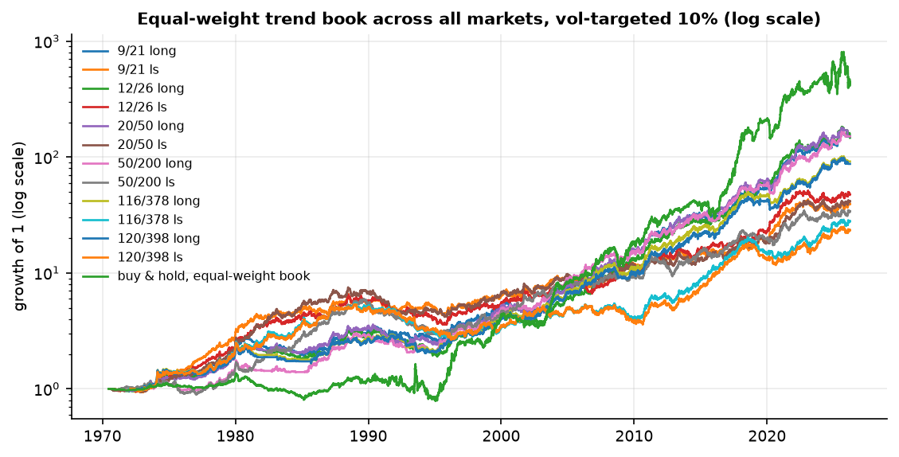

---

## 8. Where it works, where it doesn't, and the trap that explains why

Median Sharpe of 60/132 vs simply holding, by asset class (82 markets), with the median worst
drawdown each one suffered — both read straight out of `grid_ema_long.parquet` / `buy_and_hold.csv`
and cross-checked against `pair_by_asset_class.csv`:

| asset class | markets | strategy | buy & hold | wins | median max DD: strategy | …vs buy & hold |
|---|---|---|---|---|---|---|
| crypto | 3 | **1.111** | 0.559 | 67% | −55.8% | −76.6% |
| US indices | 4 | 0.658 | **0.810** | 0% | −23.1% | −21.7% |
| US large caps | 26 | 0.576 | **0.744** | 27% | −30.7% | −30.5% |
| ETFs | 4 | 0.761 | **0.886** | 25% | −22.4% | −21.1% |
| rate futures | 7 | 0.583 | 0.469 | 43% | −12.2% | −24.8% |
| arch index package (SPX, NDX) | 2 | 0.458 | 0.250 | 100% | −31.4% | −65.2% |
| commodity futures | 10 | 0.176 | 0.228 | 50% | **−70.8%** | **−88.2%** |
| equity-index futures | 10 | 0.353 | 0.408 | 10% | −47.5% | −48.6% |
| FX futures | 16 | **0.110** | 0.018 | **75%** | −28.9% | −47.9% |

Trend timing pays where returns are autocorrelated and drawdowns are lethal (crypto, FX, commodity
futures, and the two long-history SPX/NDX series, whose buy & hold drawdown is −65% because they
start at the dot-com peak) and does *not* beat holding on Sharpe in US
equities: a long-only overlay that is flat a third of the time in a one-way bull market is paying for
insurance it rarely claims. Look at the last two columns — that is what you are buying. In equities the
crossover gives you essentially no drawdown protection either (−30.7% vs −30.5%), which is the honest
form of "it doesn't work there"; in commodities and FX it cuts the worst episode by 17 and 19 points.
§7 is what that insurance is worth on the whole book.

**The negative control.** Eight fixed-clock FX *spot* series were dropped by the hygiene screen
(`results/tables/data_hygiene.csv`: lag-1 autocorrelation +0.18…+0.39, 33–62% zero daily returns) and
one of them is retained in the study only as a control, so the control table's "contaminated" figure is
a single series — read it as an existence proof, not a sample. On it, 9/21 scores Sharpe **0.444**
while the 16 properly-marked FX *futures* score a median **0.053**: an inflation of +0.392 manufactured
entirely by a stale price feed. Note the shape of the trap: the inflation is concentrated in *fast* pairs (5/35 →
+0.472, 10/20 → +0.408, 12/26 → +0.416) and vanishes for slow ones (20/100 → +0.006), and 10/100 on
the contaminated feed (0.180) is barely better than on clean ones (0.107). So this data defect
specifically manufactures the *short-term* crossover results that populate trading forums. Any "EMA
9/21 works on FX" backtest built on fixed-clock spot closes is in it.

**What each market would pick for itself** (in-sample): median chosen slow **162 bars = 7.4 months**
(IQR 4.2–17.0), median chosen fast 39. Slow ≥100 bars in 70.7% of markets; slow ≤30 in only 7.3%.
The dispersion is informative: equities/indices/ETFs/rates pick 15–18 months, crypto 7.6, equity
futures 7.5, commodity and FX futures 4.4–4.6. **Vol-scaling the lookback buys nothing**:
corr(optimal slow, annualised vol) = −0.14 and corr with lag-1 autocorrelation = −0.27 — fixed
calendar lengths are as good as adaptive ones here, which is a mildly unfashionable conclusion.

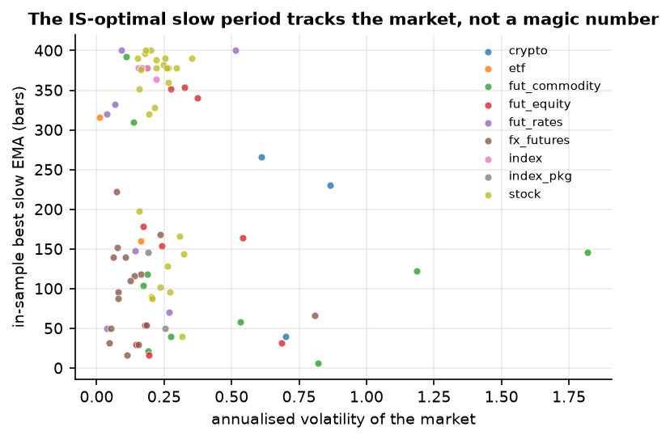
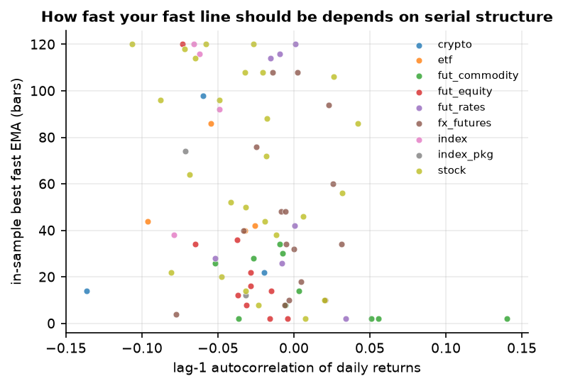

One global pair vs the per-market experts: 60/132 captures a median **69.9%** of the Sharpe each
market's own in-sample champion would get, and matches it within 10% in 6.1% of markets. The raw-IS
pick (80/144) captures 69.4% — i.e. the robust rule costs essentially nothing in capture — while
12/26 captures 53.1%. Even the "expert" answer only beats buy & hold in 63.4% of markets at its own
in-sample best.

Rolling 3-year windows per market (79 markets), long/flat median 3-year Sharpe and the share of
windows that were positive: 60/130 0.320 / 71.9% · 50/200 0.358 / 71.4% · 58/160 0.327 / 71.7% ·
12/26 0.251 / 69.8% · 9/21 0.245 / 69.1%. Long/short: 60/130 0.190 / 62.5%, 12/26 **−0.062 / 45.6%**,
9/21 −0.065 / 43.4% — the fast popular pairs are coin flips long/short across three-year windows.

---

## 9. Costs, execution, weekly bars, and whether EMAs are even the right average

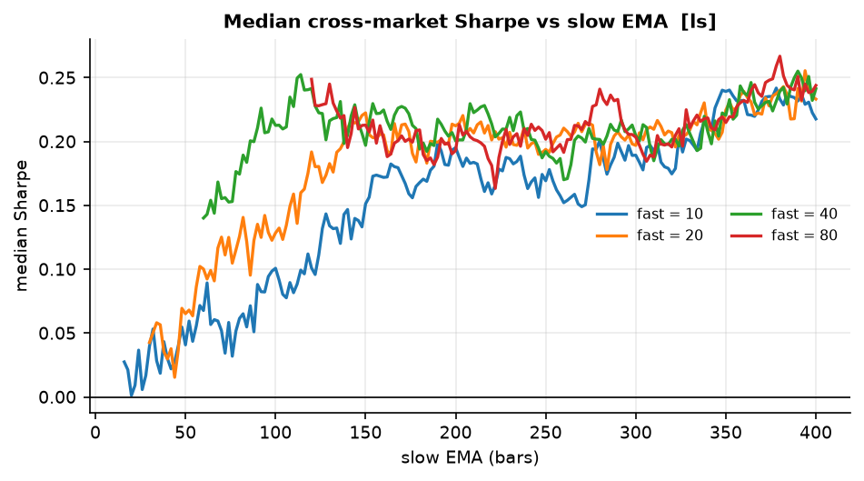

Median cross-market Sharpe of the same pair under each variant:

| pair | daily EMA 1× | 0× cost | 3× cost | weekly bars | SMA (daily) | | LS 1× | LS 0× | LS 3× | LS weekly | LS SMA |
|---|---|---|---|---|---|---|---|---|---|---|---|
| **60/132** | 0.431 | 0.434 | **0.423** | 0.315 | 0.434 | | 0.228 | 0.237 | 0.211 | 0.220 | 0.258 |
| 50/200 | 0.401 | 0.406 | 0.390 | 0.336 | 0.386 | | 0.194 | 0.201 | 0.186 | 0.230 | 0.173 |
| 12/26 | 0.319 | 0.384 | **0.252** | 0.368 | 0.302 | | 0.057 | 0.111 | **−0.058** | 0.207 | −0.033 |
| 10/20 | 0.284 | 0.351 | **0.183** | 0.388 | 0.247 | | 0.001 | 0.064 | **−0.104** | 0.219 | −0.087 |
| 116/378 | 0.414 | 0.415 | 0.412 | 0.329 | 0.396 | | 0.281 | 0.285 | 0.274 | 0.307 | 0.244 |

* **Costs punish the fast end, not the recommended end.** Median CAGR drag from commissions, per
  year: **60/132 0.10 pp** (4.83% gross → 4.73% net; 0.24 pp more at 3× cost), 50/200 0.12 pp,
  12/26 0.45 pp, 10/20 0.43 pp (and 1.27 pp more at 3×), and for the fastest cell 2/6 the gross
  2.93% becomes **0.03% net**. Long/short doubles it: 60/132 0.20 pp, 10/20 1.01 pp, and 12/26 goes
  from −0.27% to −1.15%. That asymmetry — the recommended pair barely notices trading costs, the
  popular ones are eaten by them — is the strongest practical argument for the slow plateau.
* **Execution model barely matters at this speed.** Trading at the next open rather than the close
  moves the median by **0.016 Sharpe** (39 markets with real open prices) — a direct check of the
  one-day-lag result of Bessembinder & Chan (1995). Only fast pairs are exposed.
* **EMA vs SMA is a tie here** (60/132: 0.431 EMA vs 0.434 SMA long/flat; long/short actually
  favours SMA, 0.258 vs 0.228). The exponential weighting is not the edge; the *slowness* is. This
  matches a 140-year monthly study that found equal weighting optimal, and contradicts the folk
  belief that EMA responsiveness is what makes crossovers work.
* **Weekly bars are worse for the right pair (0.315 vs 0.431) and better for the wrong ones**
  (10/20: 0.388 vs 0.284) — weekly resampling is a crutch for over-fast settings, not an upgrade.
  (Before the annualisation fix this table said the opposite; it was an artefact.)
* **Cost of the answer, for scale:** at 60/132 a market changes position about every 8 months, so a
  6 bps index / 10 bps equity implementation pays roughly **0.02–0.03% of notional per flip**, about
  0.1% a year, and at 3× costs about 0.35%. Those numbers are already inside every Sharpe above — the
  point of stating them is that this strategy's edge is not a fee artefact, whereas the fast pairs' is:
  2/6 pays 2.9 pp of CAGR a year in costs and turns a 2.93% gross return into 0.03%.

---

## 10. Statistical humility, and the literature's

Deflated Sharpe ratio (Bailey & López de Prado), hurdle = the Sharpe you would *expect* from the
best of N trials:

| pair | med Sharpe | hurdle | DSR (N = 9,299) | DSR (effective N = 232) |
|---|---|---|---|---|
| 60/132 long | 0.431 | 1.238 | 0.006 | 0.070 |
| 116/378 long | 0.414 | 1.305 | 0.004 | 0.055 |
| 50/200 long | 0.401 | 1.255 | 0.004 | 0.056 |
| 12/26 long | 0.319 | 1.211 | 0.002 | 0.036 |
| 60/132 long/short | 0.228 | 1.238 | 0.001 | 0.018 |

I treated the 9,299 trials as ~232 effectively independent ones (adjacent cells are ~the same
strategy; N = 9,299 would be punitively wrong and N = 1 self-flattering). Nothing clears 0.95.
Stated plainly: **the peak of a search this wide is not distinguishable from luck at the level of one
market's Sharpe.** What survives is (i) the plateau's **breadth** — positive in 93.9% of 82 unrelated
markets, which no single-market curve-fit manufactures — and (ii) §5(b): cross-market rankings
transfer out of sample while per-market ones anti-transfer. The defensible claim is "use the middle
of a broad hill, diversified, with drawdown reduction as the objective", not "EMA(60)>EMA(132) is a
proven edge".

Median cross-market Sharpe by decade (long/flat | long/short):

| pair | 1970s | 1980s | 1990s | 2000s | 2010s | 2020s |
|---|---|---|---|---|---|---|
| 60/132 | 0.61 \| 0.60 | 0.38 \| 0.62 | 0.14 \| 0.14 | 0.49 \| 0.30 | 0.44 \| 0.18 | **0.06 \| 0.20** |
| 50/200 | 0.19 \| 0.74 | 0.38 \| 0.74 | 0.15 \| 0.17 | 0.53 \| 0.34 | 0.42 \| 0.17 | −0.05 \| 0.17 |
| 12/26 | 0.99 \| 0.71 | 0.27 \| 0.44 | 0.17 \| 0.15 | 0.31 \| 0.24 | 0.29 \| −0.11 | 0.04 \| −0.08 |
| 116/378 | 0.50 \| 0.43 | 0.31 \| 0.38 | 0.12 \| 0.06 | 0.35 \| 0.12 | 0.41 \| 0.20 | **−0.39 \| 0.22** |

The 1990s are bad for everything, and **the 2020s are nearly flat for long/flat** while long/short
still carries 0.17–0.22 — the very-slow candidates are the worst (−0.39 for 116/378). If a live
implementation underperforms this report, this is the most likely reason. It also argues for the hedge
if you can hold it.

**Independent cross-checks:**

* *Market Timing with Moving Averages: Anatomy and Evolution of the Optimal Lookback Period*
  (SSRN; monthly S&P 1860–2009, 140-year out-of-sample test): **no single optimal lookback**; the
  optimal lookback for price-minus-SMA ranged 1–23 months with mean **10.4 months**; the
  momentum variant's mean was 7.0 months. My per-market median is **7.4 months** (IQR 4.2–17.0) and
  the cross-market answer is **6.4 months** — the same region, from a different century, a different
  frequency, and one market instead of 82. The same paper reports "**no support for the belief that
  over-weighting recent prices improves performance**" (equal weighting was optimal), which is
  exactly my EMA-vs-SMA tie.
* A 2024 study of 497 technical rules on 10 currencies (2000–2022) found SMA(9,20) best for
  *short-term* FX with predictive power decaying after ~7 days, and emerging-market currencies more
  predictable than developed ones. It also cites **Bessembinder & Chan (1995)** on nonsynchronous
  trading requiring a one-day lag between signal and outcome — the assumption my engine is built on
  and whose cost I measure at 0.016 Sharpe.
* A walk-forward study of EMA pairs on BTC reports the optimum jumping between train and test
  (7/28 in-sample vs 14/10 out-of-sample) and recommends re-evaluating every 2–3 months. My §5(a) is
  that result at 82× the sample size — and my recommendation is the opposite: don't re-tune, stay on
  the plateau, because re-tuning is what produced the −0.15 correlation.
* Practitioner lore (short 5–25, medium 50–75, long 100–200; 200-day ≈ one trading year; 50/200 as a
  regime filter; 12/26 from MACD) is a set of conventions, not tested claims. §4 is what happens when
  you test the specific famous ones on 82 markets instead of one index.

---

## 11. The recipe, as tested

```
daily bars, adjusted close
fast = EMA(60), slow = EMA(130)         # anything 40-80 / 115-165 is the same answer
long while fast > slow, else flat        # or +/-1 long/short if you need the hedge
act on the close of the signal bar       # next-open costs 0.016 Sharpe
cost 6-10 bps per position change       # 12-20 bps if long/short (2 units)
drop the first `slow` bars of each series when measuring
size the book to 10% vol, leverage <= 2.5x, equal weight across markets
do NOT re-tune per market, per year, or per asset class          (sec. 5a)
do NOT reach for slower EMAs because the extended grid likes them (sec. 6)
expect ~1.5 position changes/year per market, ~2/3 of the time long
```

**What this is for:** drawdown control on a diversified basket — at matched risk −63% → −21%, Calmar
0.11 → 0.43, Sharpe 0.74 → 0.97.
**What this is not for:** beating buy & hold on return in US equities, or producing a large positive
Sharpe in the 2020s.

---

## 12. Limitations

1. **Survivorship.** The US large-cap family is today's constituents (StarTrader), so equity results
   are upward-biased; indices, ETFs, futures and crypto are not affected.
2. **82 markets is still one sample.** The plateau's breadth is robust; the flat 2020s is one regime.
3. **Costs are per-class constants**, not a volume/participation model, and shorting equities here is
   cheaper than reality — the long/short rows flatter equity shorts.
4. **No hysteresis band, no regime filter, no volatility scaling.** I can rule the third out
   (corr −0.14). A buffer band on the crossover is the most likely improvement to the *implementation*
   because it attacks the whipsaw the decade table shows — worth testing before I would claim it.
5. **Few trades at the slow end** (≈16 round trips per market for 60/132, 4 for 150/710): cross-market
   medians are trustworthy, per-market ones are not.
6. **The neighbour-floor criterion is edge-gameable** (§6). Interior + trade-frequency + breadth
   constraints were added for that reason; a stronger fix would penalise cells whose neighbourhood
   is sparse in *strategy* space, not just in grid space.
7. The walk-forward lattice exposes only pairs on its own coarse grid, so the famous-pair OOS
   comparison comes from the split-sample test instead of the walk-forward table.

---

## 13. Reproducing it

```bash
python scripts/fetch_data.py            # 94 series -> /home/user/data/clean (sources in README)
bash    scripts/run_all.sh              # 5-pass sweep + extended grid -> results/grid_*.parquet
python  scripts/run_study.py --mode long --ma ema          # one pass, ~3 min
python  scripts/fix_annualisation.py    # exact rescale of cached grids (+ self-verification)
python  scripts/analyze.py              # tables/, figs/, summary.json  (~12 min)
python  scripts/analyze_surfaces.py     # bands, ridges, constrained best, extended-grid ridge
python  scripts/analyze_shortlist.py    # per-class, 3y consistency, decade book, home markets
python  scripts/benchmark_book.py       # buy & hold on the identical book/window
python  scripts/key_results.py          # every number quoted above, read from the result files
python  -m pytest tests/ -q             # 29 tests: engine, alignment, costs, annualisation, OOS
```

Machine-readable results: `results/summary.json` (design, surfaces, walk-forward, split-sample, DSR,
decades), `results/summary_surfaces.json` (bands/ridges/constrained picks), `results/summary_shortlist.json`,
plus CSV and markdown for every table under `results/tables/` and 14 figures under `results/figs/`.
