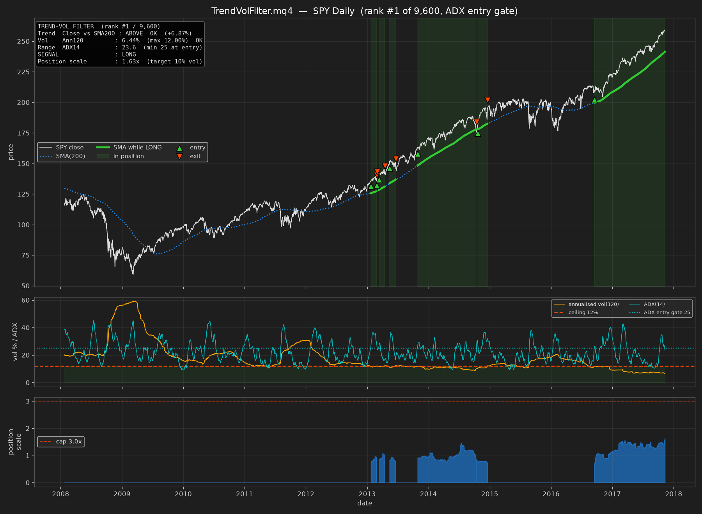

# TrendVolFilter.mq4 — MT4 indicator for strategy #1

The best-performing strategy of the 9,600 tested in this repo, ported to MQL4.



## The rule

Be **long** only when these hold at the close of a bar:

1. **Trend** — `Close > SMA(200)`
2. **Calm** — annualised realised volatility over the last **120** bars is **below 12%**
3. **Not ranging** — `ADX(14) > 25`, **checked only when opening a new position**

Position size = `10% / AnnVol(60)`, capped at **3.0x**. Flat otherwise; never short.

The signal is taken from the **last closed bar** and acted on at the next bar's open —
a deliberate 1-bar lag that matches the backtest. **The indicator does not repaint.**

## The ranging fix (v1.1)

The original rule fired in sideways markets: low volatility and chop look identical
to a vol filter. Measured across 40 symbols, **49% of round trips lasted ≤5 bars**.

The instinctive fix — requiring ADX on *every* bar — is actively harmful, because it
forces an exit each time ADX dips and then re-enters:

| variant | Sharpe | max DD | turnover | ≤5-bar trades |
|---|---|---|---|---|
| baseline (no filter) | 0.86 | −8.8% | 23.2x | 49% |
| ADX>20 **every bar** | 0.47 | −11.0% | 38.6x | — |
| ER>0.30 **every bar** | 0.08 | −14.5% | 94.7x | — |
| **ADX>25 at entry only** | **0.89** | **−6.3%** | **11.8x** | **33%** |

Gating **entries only** and letting the base rule manage exits improves everything at
once: fewer trades, half the turnover, smaller drawdown, and it holds out-of-sample
(OOS Sharpe 1.12 → **1.32**). On SPY daily, entries drop from 17 to 7 in ten years.

Set `Use_ADX_Filter = false` to restore the original behaviour.

> Note on `ADX_Min`: 30 scored even better out-of-sample (Sharpe 1.50) but its
> in-sample score was flat and trade count fell to 140. That monotonic OOS
> improvement is most likely small-sample luck, so the default is the more
> defensible **25**.

## Backtested performance

40 liquid US ETFs and mega-caps, 2007-04 → 2017-11, net of 5 bps per trade:

| metric | strategy | SPY buy & hold |
|---|---|---|
| Out-of-sample Sharpe (2014–17) | **1.32** | — |
| Full-period Sharpe | **0.89** | 0.44 |
| CAGR | 3.9% | 7.05% |
| **Max drawdown** | **−6.3%** | −56.5% |
| Calmar | 0.63 | 0.12 |
| Turnover | 11.8x/yr | — |

(Figures with the ADX entry gate on. Without it: OOS Sharpe 1.12, DD −8.8%, 23x turnover.)

On SPY daily it is in the market ~26% of the time, with 7 entries over 10 years —
it sits out crashes rather than trying to trade them.

## Install

1. In MT4: **File → Open Data Folder**
2. Copy `TrendVolFilter.mq4` into `MQL4/Indicators/`
3. In MetaEditor press **F7** to compile (or restart MT4)
4. Drag **TrendVolFilter** from the Navigator onto a chart

## Inputs

| input | default | meaning |
|---|---|---|
| `MA_Period` | 200 | trend moving-average period |
| `Vol_Window` | 120 | vol lookback for the **filter** |
| `Size_Vol_Window` | 60 | vol lookback for **sizing** (deliberately different) |
| `Vol_Max` | 0.12 | vol ceiling; above this, stay flat |
| `Use_ADX_Filter` | true | require a trending market to **enter** |
| `ADX_Period` | 14 | ADX period |
| `ADX_Min` | 25.0 | minimum ADX to open a position (never forces an exit) |
| `Vol_Target` | 0.10 | annualised vol target for position sizing |
| `Leverage_Cap` | 3.0 | maximum position scale |
| `Periods_Per_Year` | 0 | 0 = auto from timeframe (D1 → 252) |
| `Account_Risk_Pct` | 100 | equity % that 1.0x notional represents |
| `Show_Panel` / `Show_Arrows` | true | on-chart status panel and entry/exit arrows |
| `Alert_On_Signal` / `Push_On_Signal` | true / false | popup / mobile alert on state change |

## What it draws

- **Dotted blue** SMA(200); the same line turns **thick green** while a position is open
- **Green up arrow** = go long, **red down arrow** = go flat
- **Status panel** with both filter checks, the current signal, and the position scale
- Reads `LONG 1.63x` or `FLAT` in the top-right corner

## Timeframe note

The strategy was fitted on **daily bars** — run it on **D1**. On other timeframes the
annualisation adapts automatically, but the 200/120/60 parameters were never validated
there and the 12% vol ceiling will behave very differently.

## Verifying the port

`verify_parity.py` transcribes the MQL4 `OnCalculate()` loop back into Python and
compares it against the strategy code used in the search, across all 40 symbols:

```bash
python3 mt4/verify_parity.py
```

Result: **100.00% signal agreement**, worst position-size difference `1.8e-13`
(floating-point noise). The indicator reproduces the backtest exactly — including
the ADX entry gate and its carried-forward position state.

## Honest caveats

- This is an **indicator, not an EA** — it signals, it does not place orders.
- Backtested on **US equity ETFs**. On FX or crypto the 12% vol ceiling is close to
  meaningless — those assets rarely sit that calm. Re-fit before using elsewhere.
- The sample ends 2017 and its deflated Sharpe is 0.06, i.e. **not statistically
  significant after correcting for 9,600 trials**. Forward-test before risking money.
- Its edge is drawdown control, not return. It underperforms buy & hold on raw CAGR.
