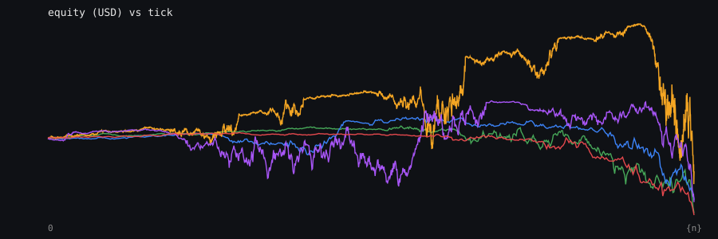
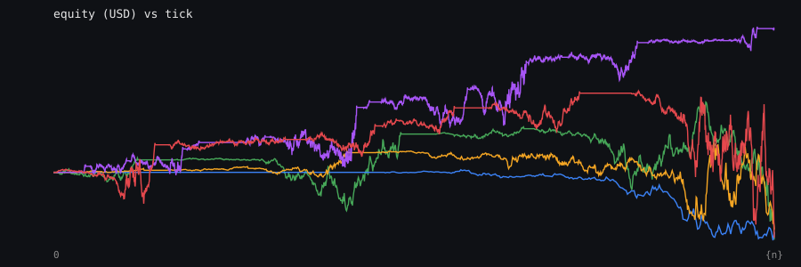
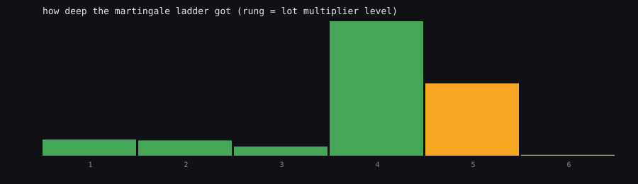
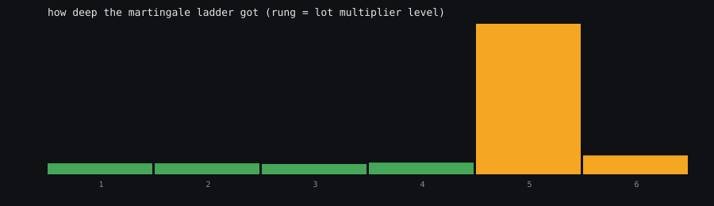

# The "No Loss" / Rule OP system, measured

Generated by `noloss_sim.py`. Re-run it any time with `python3 noloss/noloss_sim.py` - pure standard library, nothing to install.

## What was simulated

| parameter | value |
|---|---|
| starting balance | $100 |
| first lot | 0.01 |
| take profit | 20 pips |
| martingale step | 30 pips adverse |
| multiplier | 2.0x |
| spread | 1.5 pips |
| leverage | 1:500 |
| stop out | equity < 50% of used margin |
| price model | zero-drift random walk, 3.3 pips sigma/tick |
| ticks per run | 4000 |
| accounts per variant | 600 |

The price model has **zero expected return**. There is no edge in it. So every dollar these systems "earns" comes from position sizing, and every blow-up comes from the same place.

## The ladder, in plain arithmetic

Before any simulation, here is what the martingale ladder *requires*. This is not a model result, it is just multiplication.

| rung | lot | cum lot | adverse move | loss on newest rung | **floating loss on the whole stack** | basket TP payout | margin |
|---|---|---|---|---|---|---|---|
| 1 | 0.0100 | 0.010 | 0 pips | $0 | **-$0** | $2 | $2 |
| 2 | 0.0200 | 0.030 | 30 pips | $6 | **-$3** | $6 | $7 |
| 3 | 0.0400 | 0.070 | 60 pips | $24 | **-$12** | $14 | $15 |
| 4 | 0.0800 | 0.150 | 90 pips | $72 | **-$33** | $30 | $33 |
| 5 | 0.1600 | 0.310 | 120 pips | $192 | **-$78** | $62 | $68 |
| 6 | 0.3200 | 0.630 | 150 pips | $480 | **-$171** | $126 | $139 |
| 7 | 0.6400 | 1.270 | 180 pips | $1,152 | **-$360** | $254 | $279 |
| 8 | 1.2800 | 2.550 | 210 pips | $2,688 | **-$741** | $510 | $561 |
| 9 | 2.5600 | 5.110 | 240 pips | $6,144 | **-$1,506** | $1,022 | $1,124 |
| 10 | 5.1200 | 10.230 | 270 pips | $13,824 | **-$3,039** | $2,046 | $2,251 |
| 11 | 10.2400 | 20.470 | 300 pips | $30,720 | **-$6,108** | $4,094 | $4,503 |
| 12 | 20.4800 | 40.950 | 330 pips | $67,584 | **-$12,249** | $8,190 | $9,009 |

Look hard at the two loss columns, because conflating them is exactly what makes these systems look survivable. "Loss on newest rung" is what Rule-OP write-ups show you: the damage done by the position you just added, considered on its own. "Floating loss on the whole stack" is what your equity actually reads, and by rung 6 it is $171 against the $480 you were shown. Only the second column can stop you out.

With these exact settings on a $100 account at 1:500 and a 50% stop out, the deepest rung you can open is **rung 4** - just 90 pips of adverse move. Rung 5 is the one that kills you: it wants 0.16 lot on top of a stack already $33 underwater. `RuleOP_Ladder.mq4` computes the same number live and draws it as the kill price.

Read the bottom rows: by rung 10 the system is carrying 270 pips of adverse move, 10.23 lot in total, and a stack floating loss of $3,039 on a $100 account.

## Monte Carlo results

| metric | grid + martingale | hedge lock + martingale |
|---|---|---|
| accounts ending in profit | 22.0% | 18.0% |
| accounts blown up | 20.0% | 21.0% |
| runs where the broker refused the next rung | 60.2% | 62.0% |
| runs where the ladder hit its rung cap | 0.0% | 0.0% |
| median final equity | $39.16 | $35.26 |
| mean final equity | $90.33 | $81.13 |
| 10th pct final equity | $21.06 | $20.06 |
| 90th pct final equity | $293.22 | $284.16 |
| median max drawdown | $90.84 | $90.49 |
| 90th pct max drawdown | $181.10 | $177.29 |
| median deepest rung | 4 | 4 |
| 95th pct deepest rung | 5 | 5 |
| median worst floating P&L | $-82.58 | $-84.04 |
| 95th pct worst floating P&L | $-58.53 | $-60.60 |
| median completed cycles | 8 | 9 |
| **capital in** | $60,000 | $60,000 |
| **capital out** | **$54,199** (-9.7%) | **$48,680** (-18.9%) |

## Equity curves, five accounts each

## How deep did the ladder get?

## Why people believe the "no loss" claim - it is true, conditionally

This is the part almost nobody explains. Look at what a **closed** cycle actually pays, grouped by how deep the ladder had to go:

| ladder depth | share of all cycles | total lot | theoretical P&L (total lot x TP) | smallest P&L seen | mean P&L |
|---|---|---|---|---|---|
| 1 rung | 60.9% | 0.010 | $2.00 | $2.00 | $2.19 |
| 2 rungs | 22.3% | 0.030 | $6.00 | $6.00 | $6.58 |
| 3 rungs | 10.3% | 0.070 | $14.00 | $14.00 | $15.35 |
| 4 rungs | 5.3% | 0.150 | $30.00 | $30.01 | $32.83 |
| 5 rungs | 1.3% | 0.310 | $62.00 | $62.02 | $67.83 |

Across 6861 closed cycles, the *smallest* P&L booked was **$2.00**. Not one closed cycle lost money. That is not marketing - it is forced by the geometry. The basket take profit sits at the **average** entry of the stack, so the instant price reaches it the whole stack is in profit by `total_lot x TP x pip_value`.

So the claim "this system never loses" is literally true of every trade it is allowed to finish. It is false of the account, because of the 20% of accounts in this run that were never allowed to finish one. The system does not remove losses, it moves them out of the per-trade column and into a single balance-sheet event.

Two consequences of that table, and they are the whole strategy in two sentences:

1. Payout per closed cycle grows **geometrically** with ladder depth (`base_lot x (2^n - 1) x TP`). A rung-1 cycle pays $2.00; a rung-5 cycle pays $62.00. The big wins are not luck, they are the deep ladders that happened to recover.

2. The **probability** of reaching a deep rung falls at roughly the same geometric rate the payout rises, so the two effects largely cancel. That is the martingale identity: on a price series with no drift, no choice of TP, step or multiplier creates an edge. The simulation agrees - with the spread switched off the grid returns -5.7% of capital over 1500 accounts, which is close enough to zero that the fat tail easily explains the gap. Turn the spread back on and it becomes -10.3%. Costs are what convert a zero-expectation game into a losing one.

## Why the hedge version is worse, and it is not the spread

| variant | accounts | capital returned | accounts blown up | accounts in profit |
|---|---|---|---|---|
| grid spread=0 | 1500 | -5.7% | 22.7% | 23.5% |
| grid spread=1.5 | 1500 | -10.3% | 19.4% | 21.0% |
| hedge spread=0 | 1500 | -14.7% | 22.3% | 19.6% |
| hedge spread=1.5 | 1500 | -18.0% | 22.7% | 18.3% |

Set the spread to zero and the gap is still there: -5.7% for the grid against -14.7% for the hedge. So costs are not the explanation. The mechanism is structural:

When the winning hedge leg takes profit, the surviving losing leg is entered at the **hedge** price, but the whole position only closes at `average entry + TP`. Because the survivor's entry is one TP distance behind, price has to recover that first. The result is that the hedge needs a deeper ladder to close the same recovery:

| ladder depth | grid: share of cycles | hedge: share of recoveries |
|---|---|---|
| 1 | 60.9% | 17.2% |
| 2 | 22.3% | 47.6% |
| 3 | 10.3% | 22.6% |
| 4 | 5.3% | 10.3% |
| 5 | 1.3% | 2.2% |
| 6 | 0.0% | 0.0% |

35.2% of hedge recoveries need 3+ rungs versus 16.8% for the grid. Deeper ladders are the tail risk, so the "safety lock" you were sold actually buys more of it. The hedge also books a small profit 4117 times that it then gives back on the recovery close, which adds cost without adding any offsetting edge.

## The universal objection: "just use a smaller lot"

This is the finding worth the most, because it is counter-intuitive and it survived a re-run at higher sample size.

| base lot | stopped out | margin-blocked | **failed either way** | median final equity | capital returned | deepest rung |
|---|---|---|---|---|---|---|
| 0.01 | 19.4% | 60.7% | **80.0%** | $40.00 | -8.9% | 6 |
| 0.005 | 26.5% | 39.0% | **65.5%** | $43.45 | -6.7% | 6 |
| 0.002 | 9.1% | 39.6% | **48.7%** | $109.26 | -5.9% | 7 |
| 0.001 | 2.2% | 31.8% | **34.1%** | $119.66 | -3.5% | 8 |

Shrinking the lot does cut the overall failure rate - look at the bold column, it falls from 80% to 34%. But read *which* failure it removes. Almost all of the improvement is in the margin-blocked column (61% down to 32%), because a small lot can actually fund a full ladder. The stopped-out column, which is the catastrophic one, does not fall cleanly - it rises at first (19% to 26%) before collapsing at the very smallest size.

So a smaller lot buys you a longer life with more green days, and shifts the way it ends from a quiet margin refusal toward a violent stop-out. Capital returned improves a little and stays negative in every row. You are not buying an edge, you are buying time.

## What this means in practice

- The system's win rate is real and high. Its expected value is not.

- Every parameter you can tune (TP, step, multiplier, lot) changes the *shape* of the distribution - how often the tail hits and how big it is - never its sign.

- The failure has two faces. About 60% of the time the account simply runs out of margin and the ladder cannot fund its next rung. About 20% of the time a single trending move takes it to the stop-out level in one go. Either way the run ends, and both happen after a long run of small green days that made the method look proven.

- Anyone selling this with a money-back guarantee is short the tail. The guarantee is funded by the students who have not been trading long enough to hit it yet.

